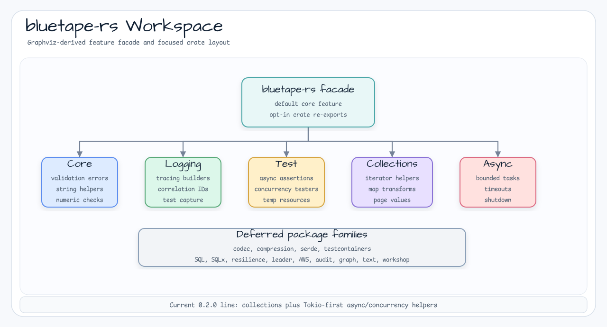

# bluetape-rs

[English](README.md) | [한국어](README.ko.md)

Rust backend primitives for the bluetape ecosystem.



`bluetape-rs` is a new WIP repository. It is not a port of the Kotlin/JVM
`bluetape4k` libraries and it is not a rewrite of `bluetape-go`. The goal is to
provide Rust-native building blocks for backend services where compile-time
contracts, small native binaries, explicit error handling, and deterministic
integration tests matter.

## Current Status

The current package scope is the `0.2.0` collections and async/concurrency
release line.

Completed foundation and `0.2.0` work stays narrow:

- define the workspace layout and release policy
- add general helper functions for typed validation errors, strings, and small
  numeric checks
- add logging and tracing support without forcing a global subscriber from
  library code, including scoped test capture helpers
- add reusable test helpers for async assertions, `MultithreadingTester`,
  `SuspendedJobTester`, and temporary resource cleanup
- add focused collection helpers and Tokio-first bounded task helpers for the
  `0.2.0` line
- keep all APIs Rust-native instead of copying Kotlin extension APIs or Go
  package shapes

`0.2.0` does not include codec, compression, serialization, Testcontainers,
SQL, resilience, or leader election packages. Those tracks remain separate
milestones so their dependency and runtime costs stay explicit.

## Intended Package Families

| Area | Working name | Purpose |
|---|---|---|
| Core | `bluetape-rs-core` | Typed validation errors, validation helpers, string helpers, and small numeric checks. |
| Logging | `bluetape-rs-logging` | Tracing setup helpers, structured fields, bounded correlation IDs, and scoped test capture. |
| Testing | `bluetape-rs-test` | Async assertions, `MultithreadingTester`, `SuspendedJobTester`, temporary resources, and future Testcontainers boundaries. |
| Collections | `bluetape-rs-collections` | Focused iterator, slice, map, grouping, chunking, and error-aware transform helpers. |
| Async | `bluetape-rs-async` | Tokio-first bounded task execution, timeout/deadline, cancellation, and shutdown helpers. |
| Encoding | `bluetape-rs-codec` | Base encoders, hex, URL-safe codecs, and small binary/text codec helpers. |
| Compression | `bluetape-rs-compression` | Opt-in compression helpers and registry-style codec selection. |
| Serialization | `bluetape-rs-serde` | Safe serializer/deserializer interfaces and test helpers around serde-compatible formats. |
| Testcontainers | `bluetape-rs-testcontainers` | PostgreSQL, Redis, MySQL, NATS, Kafka, and emulator fixture helpers behind explicit features. |
| Leader | `bluetape-rs-leader` | Redis, SQL, etcd, and Kubernetes Lease leader election. |
| SQL | `bluetape-rs-sql` | SQL AST, dialect rendering, bind collection, typed query construction. |
| SQLx | `bluetape-rs-sqlx` | SQLx executor, pool, transaction, migration, and repository adapters. |
| Resilience | `bluetape-rs-resilience` | Retry, timeout, circuit breaker, bulkhead, backoff, and service policies. |
| AWS | `bluetape-rs-aws` | Thin helpers around the official AWS SDK for Rust. |
| Audit | `bluetape-rs-audit` | Snapshot, diff, outbox, and event-stream primitives inspired by audit workloads. |
| Graph | `bluetape-rs-graph` | Graph model, bulk I/O, and backend adapters where Rust drivers are mature enough. |
| Text | `bluetape-rs-text` | Aho-Corasick search, blockword masking, tokenizer wrappers, and language detection. |
| Workshop | `bluetape-rs-workshop` | Runnable axum, Tokio, SQLx, Redis, AWS, graph, and text examples. |

## Design Position

Rust should provide a different value proposition from the existing libraries:

- stronger type-level contracts for SQL, nullability, transaction scope, and
  dialect capabilities
- explicit `Result`/`Option` based failure and absence handling
- `Send`/`Sync` aware concurrency boundaries
- low runtime overhead and small deployable binaries
- Testcontainers-backed tests for infrastructure-facing packages

The first release should stay boring and broadly reusable: helpers, logging, and
test support. Codec, compression, serialization, Testcontainers, and leader
election should be split into separate milestones. Relational SQL should come
after Testcontainers and before resilience. Leader election should come after
SQL and resilience because Redis, RDB, etcd, and Kubernetes Lease support make it
a larger multi-backend track. When SQL starts, its initial shape should be an
inspectable SQL AST plus SQLx execution adapter, not a full ORM.

## Using The Crates

The root facade enables only `core` by default. Enable optional facade modules
explicitly, or depend on the focused crates directly when you want a smaller
dependency surface.

```toml
[dependencies]
bluetape-rs = { version = "0.1.1", features = ["logging"] }

[dev-dependencies]
bluetape-rs = { version = "0.1.1", features = ["test"] }
```

```rust
use bluetape_rs::{core, logging};
```

Focused crates use underscore import names:

```toml
[dependencies]
bluetape-rs-core = "0.1.1"
bluetape-rs-logging = "0.1.1"
bluetape-rs-collections = "0.2.0"
bluetape-rs-codec = "0.3.0"

[dev-dependencies]
bluetape-rs-test = "0.1.1"
```

```rust
use bluetape_rs_core::require_not_blank;
use bluetape_rs_logging::CorrelationId;
use bluetape_rs_collections::{Page, iter};
// bluetape_rs_codec will expose focused encoder APIs during the 0.3.0 line.
use bluetape_rs_test::TempDir;
```

For collection helpers:

```rust
use bluetape_rs_collections::{Page, iter};

let page = Page::with_meta(vec!["a", "b"], 0, 2, 5).unwrap();
assert_eq!(page.total_pages(), 3);

let chunks: Vec<_> = iter::chunks(1..=5, 2).unwrap().collect();
assert_eq!(chunks, vec![vec![1, 2], vec![3, 4], vec![5]]);
```

For Tokio task and control helpers:

```toml
[dependencies]
bluetape-rs-async = "0.2.0"
```

```rust
use std::time::Duration;

use bluetape_rs_async::{try_map_bounded, with_timeout};

async fn run() -> Result<(), Box<dyn std::error::Error>> {
    let doubled = try_map_bounded([1, 2, 3], 2, |value| async move {
        Ok::<_, &'static str>(value * 2)
    })
    .await?;

    assert_eq!(doubled, vec![2, 4, 6]);

    let value = with_timeout(Duration::from_millis(50), async { 42 }).await?;
    assert_eq!(value, 42);
    Ok(())
}
```

For codec helpers:

```toml
[dependencies]
bluetape-rs-codec = "0.3.0"
```

`bluetape-rs-codec` is the `0.3.0` crate boundary for strict hex, Base64, and
URL-safe encoding helpers. Compression remains deferred to `0.4.0`, and
serde-oriented serialization remains deferred to `0.5.0`.

## Development

```bash
cargo fmt --all
cargo test --workspace
cargo test --workspace --all-features
cargo clippy --workspace --all-targets --all-features -- -D warnings
```

## Project Management

- [Current WIP](WIP.md)
- [Research index](docs/research/README.md)
- [Backend library feasibility](docs/research/2026-06-08-backend-library-feasibility.md)

## Project Rules

- Keep APIs idiomatic to Rust.
- Do not mechanically port Kotlin/JVM or Go APIs.
- Prefer focused crates over a catch-all utility package.
- Add real container-backed smoke tests before claiming infrastructure support.
- Keep public documentation in English and maintain Korean README parity.
