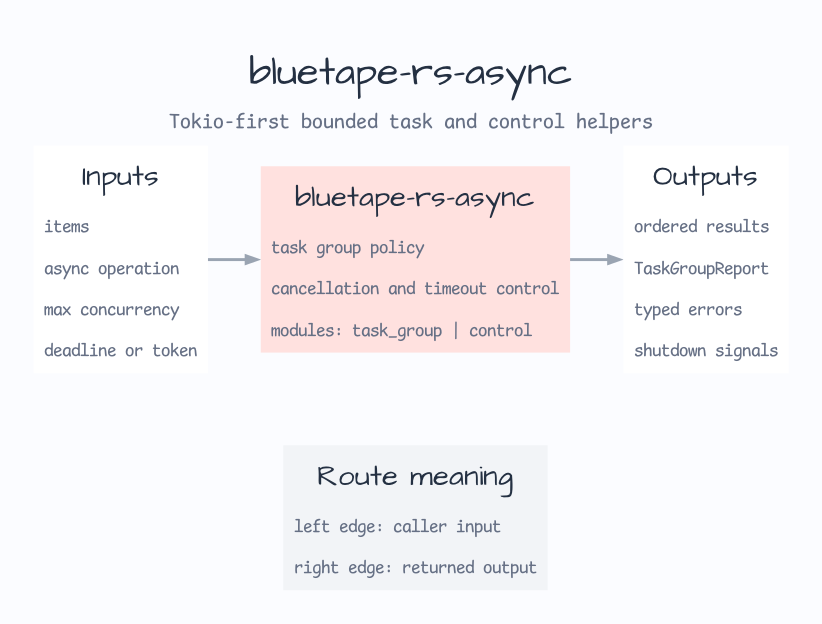

# bluetape-rs-async

Tokio-first async task helpers for bluetape-rs.



This crate starts as the `0.2.0` async/concurrency boundary. It provides small
helpers for bounded task execution and explicit failure behavior. It wraps
common task lifecycle policies without replacing Tokio primitives or
service-specific shutdown, timeout, and deadline policy.

## Scope

- bounded task scheduling with an explicit maximum concurrency
- first-error execution that aborts and drains sibling tasks
- collect-all execution that records operation successes and operation errors
- typed errors for invalid bounds and Tokio task join failures
- timeout and deadline wrappers around `tokio::time`
- cancellation and shutdown signals built on owned Tokio watch channels

This crate does not run blocking work on core async tasks. Use
`tokio::task::spawn_blocking` or a service-specific worker boundary when the
operation can block an executor thread.

## Usage

```toml
[dependencies]
bluetape-rs-async = "0.2.0"
```

```rust
use bluetape_rs_async::try_map_bounded;

# async fn demo() -> Result<(), bluetape_rs_async::TaskGroupError<&'static str>> {
let values = try_map_bounded([1, 2, 3], 2, |value| async move {
    Ok::<_, &'static str>(value * 2)
})
.await?;

assert_eq!(values, vec![2, 4, 6]);
# Ok(())
# }
```

```rust
use std::time::Duration;

use bluetape_rs_async::with_timeout;

# async fn demo() -> Result<(), bluetape_rs_async::AsyncControlError> {
let value = with_timeout(Duration::from_millis(50), async { 42 }).await?;
assert_eq!(value, 42);
# Ok(())
# }
```
