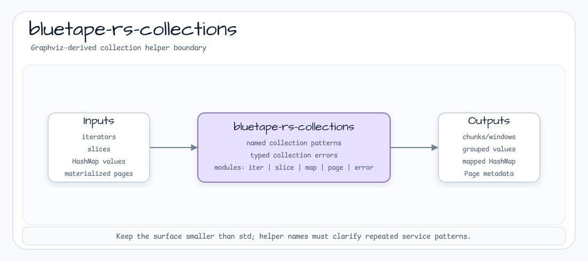

# bluetape-rs-collections

[English](README.md) | [한국어](README.ko.md)

bluetape-rs를 위한 focused collection 및 iterator helper입니다.



이 crate는 `0.4.0` workspace release에 포함됩니다. 초기 surface를 작게 유지해,
standard library iterator, slice, map method보다 더 표현력이 있을 때만 helper
API를 추가합니다.

## 범위

- `iter`: owned chunk, sliding window, predicate chunking, grouping,
  frequency count, `Result` partitioning
- `map`: `HashMap` value transform helper
- `page`: 이미 materialize된 item collection을 위한 page metadata value type
- `slice`: clamped signed range와 borrow가 유용한 zero-copy padding
- `Result` 기반 흐름을 더 명확히 하는 error-aware transform

## 사용 예

```toml
[dependencies]
bluetape-rs-collections = "0.4.0"
```

```rust
use std::collections::HashMap;

use bluetape_rs_collections::{iter, map, slice, Page};

let windows: Vec<_> = iter::sliding_windows([1, 2, 3, 4], 3, true)
    .unwrap()
    .collect();
assert_eq!(windows, vec![vec![1, 2, 3], vec![2, 3, 4], vec![3, 4], vec![4]]);

let values = HashMap::from([("a", 1), ("b", 2)]);
let doubled = map::map_values(values, |value| value * 2);
assert_eq!(doubled.get("a"), Some(&2));

let values = [1, 2, 3, 4, 5];
assert_eq!(slice::clamped_subslice(&values, -10, 3), &[1, 2, 3]);

let page = Page::with_meta(vec!["a", "b"], 0, 2, 5).unwrap();
assert_eq!(page.total_pages(), 3);
```
