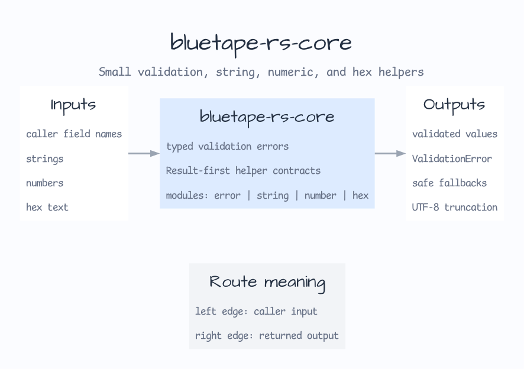

# bluetape-rs-core

[English](README.md) | [한국어](README.ko.md)

bluetape-rs crate들이 공유하는 작고 Rust다운 helper입니다.



이 crate는 의도적으로 좁게 유지합니다. `std`, `Option`, `Result` 조합만으로
작업을 명확하게 표현할 수 있다면 그 방식을 우선하세요.

## 범위

- typed validation error
- string validation 및 fallback helper
- UTF-8 byte boundary를 지키는 truncation
- checked numeric clamp와 hex predicate

## 사용 예

```toml
[dependencies]
bluetape-rs-core = "0.4.0"
```

```rust
use bluetape_rs_core::require_not_blank;

let name = require_not_blank("name", "bluetape").expect("valid name");
assert_eq!(name, "bluetape");
```
