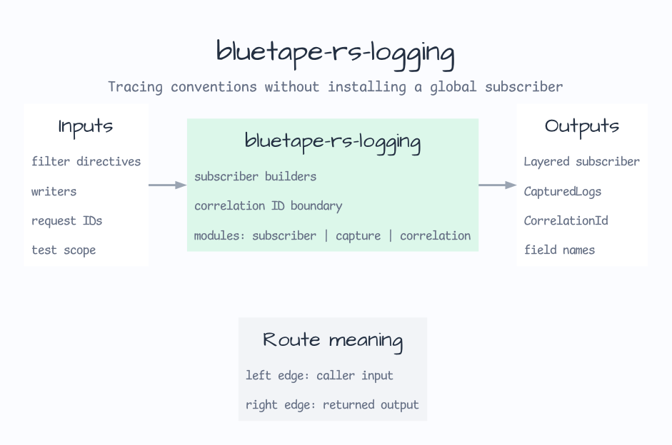

# bluetape-rs-logging

Small `tracing` conventions and subscriber builders for bluetape-rs.



Library code must not install a process-global subscriber. Applications own the
decision to install the subscriber returned by this crate.

## Usage

```toml
[dependencies]
bluetape-rs-logging = "0.1.1"
```

```rust
use bluetape_rs_logging::CorrelationId;

let correlation_id = CorrelationId::new("request-1").expect("valid id");
assert_eq!(correlation_id.as_str(), "request-1");
```
