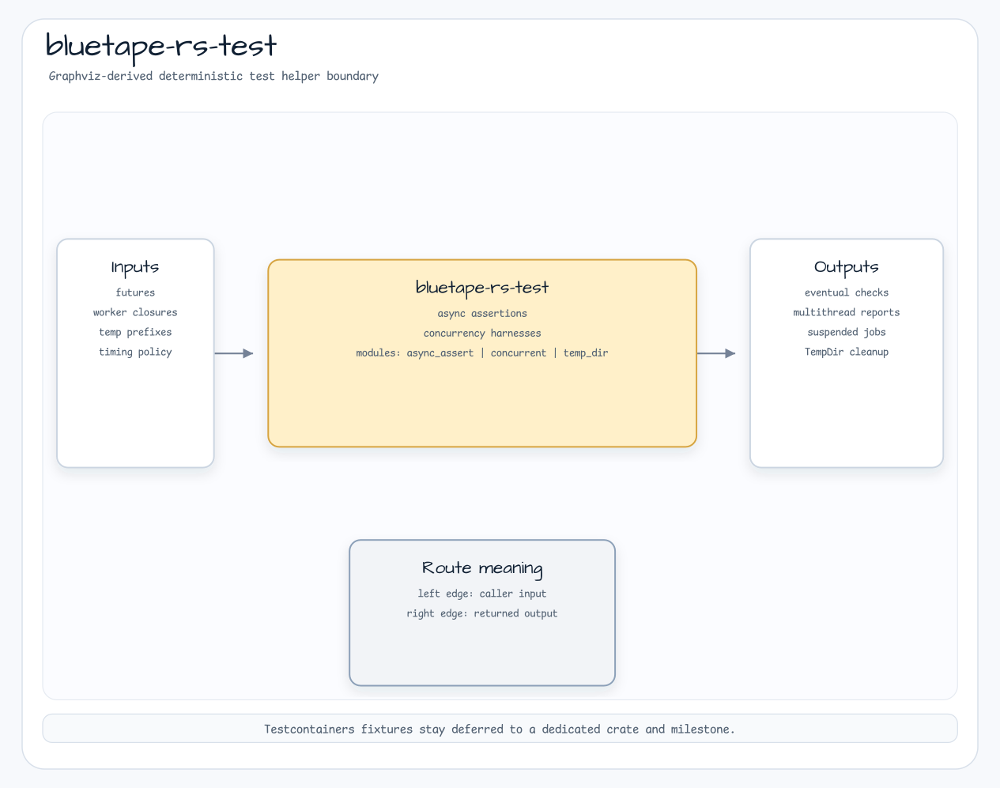

# bluetape-rs-test

[English](README.md) | [한국어](README.ko.md)

bluetape-rs crate에서 재사용하는 test helper입니다.



이 crate는 deterministic async assertion, `MultithreadingTester`,
`SuspendedJobTester`, temporary resource cleanup helper를 제공합니다.
Testcontainers fixture는 의도적으로 `bluetape-rs-testcontainers` milestone까지
분리합니다.

## 사용 예

```toml
[dev-dependencies]
bluetape-rs-test = "0.4.0"
```

```rust
use bluetape_rs_test::TempDir;

let temp = TempDir::new("bluetape-rs-test").expect("temp dir");
assert!(temp.path().exists());
temp.close().expect("cleanup");
```
