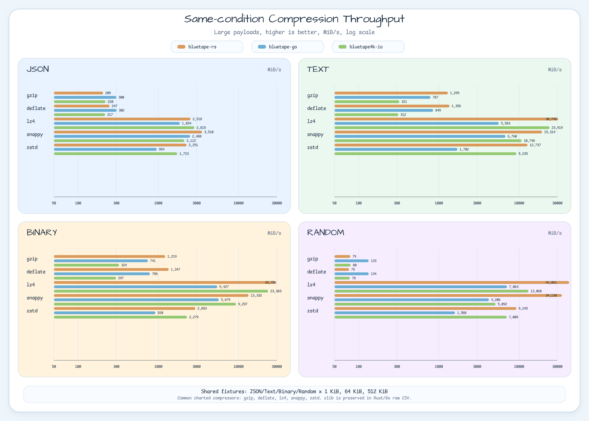
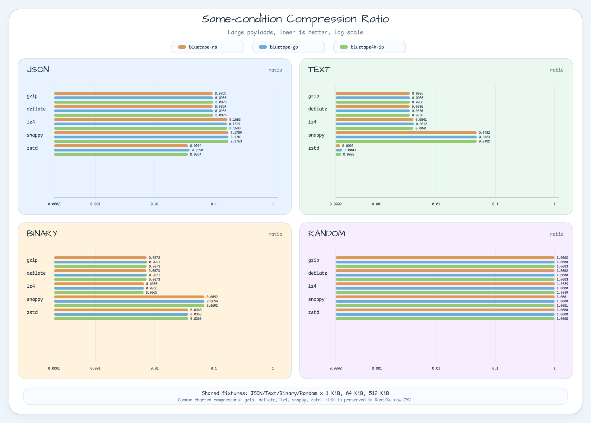

# Same-condition Compression Benchmark

This report compares `bluetape-rs`, `bluetape-go`, and `bluetape4k-io` with the same payload fixtures.
It is a local same-condition snapshot, not a production ranking or regression threshold.

## Run Conditions

- Date: 2026-06-11
- Host: Apple M5, darwin/arm64
- Fixtures: `(cd benchmark/compression-benchmark/go && go run ./cmd/generate-payloads)`
- Rust: `cargo run -p compression-benchmark --release -- --payload-dir /tmp/bluetape-compression-bench/payloads --output docs/benchmark/compression-same-condition-rust.csv`
- Go: `go test -run '^$' -bench '^BenchmarkSameConditionCompressors' -benchmem -benchtime=100ms -count=1 ./...`
- JVM: `./gradlew :bluetape4k-io:test --tests 'io.bluetape4k.io.benchmark.SameConditionCompressorBenchmarkTest' --no-build-cache --rerun-tasks`
- Shared fixtures: `/tmp/bluetape-compression-bench/payloads`
- Matrix: JSON/Text/Binary/Random x small 1 KiB, medium 64 KiB, large 512 KiB
- Throughput: higher is better; all CSV/report/chart throughput values are normalized to MiB/s
- Compression ratio: lower is better
- Source revisions and fixture hashes: `docs/benchmark/compression-same-condition-metadata.md`
- CSV schema is normalized across ecosystems; `timing_provenance` records the source harness.

## Caveats

- This is a single local run on one host.
- Rust, Go, and JVM use different lightweight harnesses, so short-window timing noise is expected.
- Use the table for broad comparison under identical payload bytes, not for stable production rankings.
- `zlib` is preserved in Rust/Go raw CSVs but excluded from common charts because the JVM comparison set does not include zlib.

## Large Payload Results

| payload | compressor | rs MiB/s | rs ratio | go MiB/s | go ratio | jvm MiB/s | jvm ratio |
|---|---:|---:|---:|---:|---:|---:|---:|
| json | gzip | 205.02 | 0.095457 | 300.03 | 0.09661 | 219.81 | 0.097603 |
| json | deflate | 246.88 | 0.095423 | 302.32 | 0.09657 | 217.38 | 0.09758 |
| json | lz4 | 2517.99 | 0.168257 | 1853.68 | 0.1649 | 2815.12 | 0.168257 |
| json | snappy | 3509.70 | 0.175915 | 2487.54 | 0.1761 | 2112.08 | 0.176342 |
| json | zstd | 2250.60 | 0.036383 | 954.41 | 0.03897 | 1723.05 | 0.03639 |
| text | gzip | 1295.25 | 0.003597 | 786.51 | 0.003605 | 321.42 | 0.003597 |
| text | deflate | 1356.30 | 0.003563 | 848.76 | 0.003571 | 311.92 | 0.003574 |
| text | lz4 | 30745.58 | 0.004112 | 5582.97 | 0.004173 | 23918.64 | 0.004114 |
| text | snappy | 19314.34 | 0.048193 | 6759.50 | 0.04837 | 10745.96 | 0.048199 |
| text | zstd | 12737.49 | 0.000238 | 1702.50 | 0.0002594 | 9235.03 | 0.000246 |
| binary | gzip | 1219.35 | 0.007307 | 741.22 | 0.007381 | 324.16 | 0.007326 |
| binary | deflate | 1346.92 | 0.007273 | 786.17 | 0.007347 | 296.65 | 0.007303 |
| binary | lz4 | 28756.29 | 0.006577 | 5426.70 | 0.006569 | 23382.62 | 0.006504 |
| binary | snappy | 13331.88 | 0.069229 | 5678.85 | 0.06941 | 9296.57 | 0.069229 |
| binary | zstd | 2893.03 | 0.036787 | 919.81 | 0.03681 | 2278.99 | 0.036795 |
| random | gzip | 78.81 | 1.0002 | 133.36 | 1 | 79.66 | 1.00034 |
| random | deflate | 76.04 | 1.00016 | 133.67 | 1 | 77.69 | 1.00032 |
| random | lz4 | 42060.99 | 1.00393 | 7062.94 | 1 | 13067.62 | 1.00393 |
| random | snappy | 34129.69 | 1.00005 | 4206.03 | 1 | 5091.86 | 1.00005 |
| random | zstd | 9245.00 | 1.00004 | 1587.56 | 1 | 7008.52 | 1.00005 |

## Raw CSV

- `docs/benchmark/compression-same-condition-rust.csv`
- `docs/benchmark/compression-same-condition-go.csv`
- `docs/benchmark/compression-same-condition-jvm.csv`
- `docs/benchmark/compression-fixtures-manifest.csv`
- `docs/benchmark/raw/go-same-condition.txt`
- `docs/benchmark/compression-same-condition-metadata.md`
