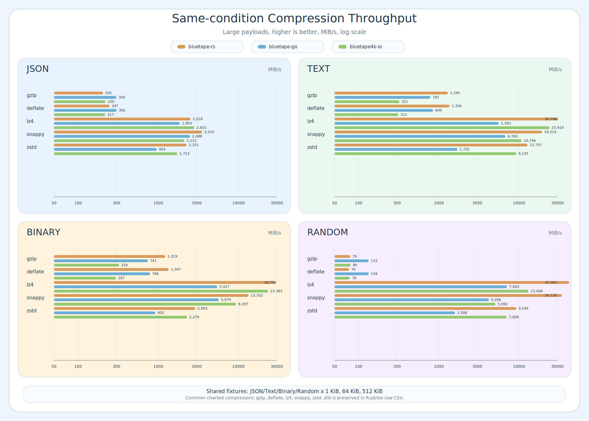
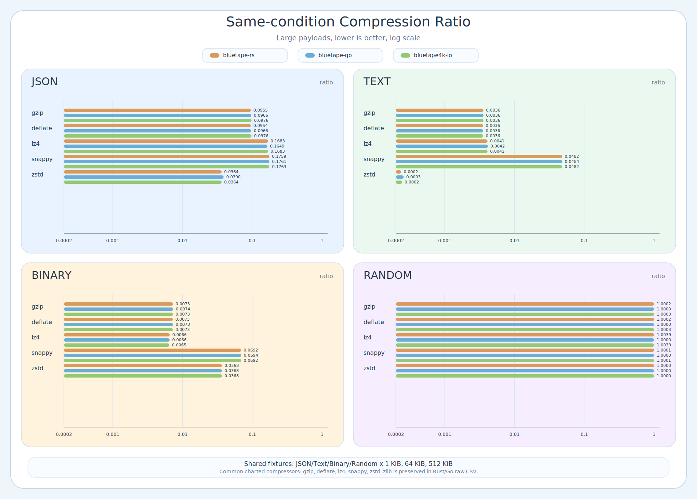

# Same-condition Compression Benchmark

This report compares `bluetape-rs`, `bluetape-go`, and `bluetape4k-io` with the same payload fixtures.
It is a local same-condition snapshot, not a production ranking or regression threshold.

## Run Conditions

- Date: 2026-06-11
- Host: Apple M5, darwin/arm64
- Repository root: `/Users/debop/work/bluetape4k/bluetape-rs`
- Required sibling checkouts: `/Users/debop/work/bluetape4k/bluetape-go` and `/Users/debop/work/bluetape4k/bluetape4k-projects` at the revisions in metadata.
- Fixtures: `(cd benchmark/compression-benchmark/go && go run ./cmd/generate-payloads --output-dir /tmp/bluetape-compression-bench/payloads --manifest ../../../docs/benchmark/compression-fixtures-manifest.csv)`
- Rust cwd: repository root; command: `cargo run -p compression-benchmark --release --locked -- --payload-dir /tmp/bluetape-compression-bench/payloads --output docs/benchmark/compression-same-condition-rust.csv`
- Go cwd: `benchmark/compression-benchmark/go`; command: `go test -run '^$' -bench '^BenchmarkSameConditionCompressors' -benchmem -benchtime=100ms -count=1 ./... > ../../../docs/benchmark/raw/go-same-condition.txt`
- JVM: tracked CSV preserved from the same local snapshot; rerun is BLOCKED because the recorded `bluetape4k-projects` revision does not contain a tracked same-condition benchmark test selector.
- Shared fixtures: `/tmp/bluetape-compression-bench/payloads`
- Matrix: JSON/Text/Binary/Random x small 1 KiB, medium 64 KiB, large 512 KiB
- Throughput: higher is better; all CSV/report/chart throughput values are normalized to MiB/s
- Compression ratio: lower is better
- Go allocation counters are preserved in `docs/benchmark/raw/go-same-condition.txt`; the normalized cross-ecosystem CSV keeps common metrics only.
- Source revisions and fixture hashes: `docs/benchmark/compression-same-condition-metadata.md`
- CSV schema is normalized across ecosystems; `timing_provenance` records the source harness.

## Caveats

- This is a single local run on one host.
- Rust, Go, and JVM use different lightweight harnesses, so short-window timing noise is expected.
- Use the table for broad comparison under identical payload bytes, not for stable production rankings.
- Allocation data is Go-only raw `-benchmem` evidence and is not normalized across Rust/JVM/Go.
- `zlib` is preserved in Rust/Go raw CSVs but excluded from common charts because the JVM comparison set does not include zlib.

## Per-Ecosystem Large Payload Snapshots

These per-ecosystem snapshots come first so raw ecosystem behavior stays visible before normalized comparisons.

### bluetape-rs

| payload | compressor | MiB/s | ratio |
|---|---:|---:|---:|
| json | gzip | 205.02 | 0.095457 |
| json | deflate | 246.88 | 0.095423 |
| json | lz4 | 2517.99 | 0.168257 |
| json | snappy | 3509.70 | 0.175915 |
| json | zstd | 2250.60 | 0.036383 |
| text | gzip | 1295.25 | 0.003597 |
| text | deflate | 1356.30 | 0.003563 |
| text | lz4 | 30745.58 | 0.004112 |
| text | snappy | 19314.34 | 0.048193 |
| text | zstd | 12737.49 | 0.000238 |
| binary | gzip | 1219.35 | 0.007307 |
| binary | deflate | 1346.92 | 0.007273 |
| binary | lz4 | 28756.29 | 0.006577 |
| binary | snappy | 13331.88 | 0.069229 |
| binary | zstd | 2893.03 | 0.036787 |
| random | gzip | 78.81 | 1.0002 |
| random | deflate | 76.04 | 1.00016 |
| random | lz4 | 42060.99 | 1.00393 |
| random | snappy | 34129.69 | 1.00005 |
| random | zstd | 9245.00 | 1.00004 |

### bluetape-go

| payload | compressor | MiB/s | ratio |
|---|---:|---:|---:|
| json | gzip | 300.03 | 0.09661 |
| json | deflate | 302.32 | 0.09657 |
| json | lz4 | 1853.68 | 0.1649 |
| json | snappy | 2487.54 | 0.1761 |
| json | zstd | 954.41 | 0.03897 |
| text | gzip | 786.51 | 0.003605 |
| text | deflate | 848.76 | 0.003571 |
| text | lz4 | 5582.97 | 0.004173 |
| text | snappy | 6759.50 | 0.04837 |
| text | zstd | 1702.50 | 0.0002594 |
| binary | gzip | 741.22 | 0.007381 |
| binary | deflate | 786.17 | 0.007347 |
| binary | lz4 | 5426.70 | 0.006569 |
| binary | snappy | 5678.85 | 0.06941 |
| binary | zstd | 919.81 | 0.03681 |
| random | gzip | 133.36 | 1 |
| random | deflate | 133.67 | 1 |
| random | lz4 | 7062.94 | 1 |
| random | snappy | 4206.03 | 1 |
| random | zstd | 1587.56 | 1 |

### bluetape4k-io

| payload | compressor | MiB/s | ratio |
|---|---:|---:|---:|
| json | gzip | 219.81 | 0.097603 |
| json | deflate | 217.38 | 0.09758 |
| json | lz4 | 2815.12 | 0.168257 |
| json | snappy | 2112.08 | 0.176342 |
| json | zstd | 1723.05 | 0.03639 |
| text | gzip | 321.42 | 0.003597 |
| text | deflate | 311.92 | 0.003574 |
| text | lz4 | 23918.64 | 0.004114 |
| text | snappy | 10745.96 | 0.048199 |
| text | zstd | 9235.03 | 0.000246 |
| binary | gzip | 324.16 | 0.007326 |
| binary | deflate | 296.65 | 0.007303 |
| binary | lz4 | 23382.62 | 0.006504 |
| binary | snappy | 9296.57 | 0.069229 |
| binary | zstd | 2278.99 | 0.036795 |
| random | gzip | 79.66 | 1.00034 |
| random | deflate | 77.69 | 1.00032 |
| random | lz4 | 13067.62 | 1.00393 |
| random | snappy | 5091.86 | 1.00005 |
| random | zstd | 7008.52 | 1.00005 |

## Winner Summary

Large-payload compression winners are separated by metric because faster compressors are not always the smallest-output compressors.

| payload | throughput winner | MiB/s | ratio winner | ratio |
|---|---:|---:|---:|---:|
| json | bluetape-rs snappy | 3509.70 | bluetape-rs zstd | 0.036383 |
| text | bluetape-rs lz4 | 30745.58 | bluetape-rs zstd | 0.000238 |
| binary | bluetape-rs lz4 | 28756.29 | bluetape4k-io lz4 | 0.006504 |
| random | bluetape-rs lz4 | 42060.99 | bluetape-go gzip | 1 |

## Normalized Large Payload Comparison

| payload | compressor | rs MiB/s | rs ratio | go MiB/s | go ratio | jvm MiB/s | jvm ratio |
|---|---:|---:|---:|---:|---:|---:|---:|
| json | gzip | 205.02 | 0.095457 | 300.03 | 0.09661 | 219.81 | 0.097603 |
| json | deflate | 246.88 | 0.095423 | 302.32 | 0.09657 | 217.38 | 0.09758 |
| json | lz4 | 2517.99 | 0.168257 | 1853.68 | 0.1649 | 2815.12 | 0.168257 |
| json | snappy | 3509.70 | 0.175915 | 2487.54 | 0.1761 | 2112.08 | 0.176342 |
| json | zstd | 2250.60 | 0.036383 | 954.41 | 0.03897 | 1723.05 | 0.03639 |
| text | gzip | 1295.25 | 0.003597 | 786.51 | 0.003605 | 321.42 | 0.003597 |
| text | deflate | 1356.30 | 0.003563 | 848.76 | 0.003571 | 311.92 | 0.003574 |
| text | lz4 | 30745.58 | 0.004112 | 5582.97 | 0.004173 | 23918.64 | 0.004114 |
| text | snappy | 19314.34 | 0.048193 | 6759.50 | 0.04837 | 10745.96 | 0.048199 |
| text | zstd | 12737.49 | 0.000238 | 1702.50 | 0.0002594 | 9235.03 | 0.000246 |
| binary | gzip | 1219.35 | 0.007307 | 741.22 | 0.007381 | 324.16 | 0.007326 |
| binary | deflate | 1346.92 | 0.007273 | 786.17 | 0.007347 | 296.65 | 0.007303 |
| binary | lz4 | 28756.29 | 0.006577 | 5426.70 | 0.006569 | 23382.62 | 0.006504 |
| binary | snappy | 13331.88 | 0.069229 | 5678.85 | 0.06941 | 9296.57 | 0.069229 |
| binary | zstd | 2893.03 | 0.036787 | 919.81 | 0.03681 | 2278.99 | 0.036795 |
| random | gzip | 78.81 | 1.0002 | 133.36 | 1 | 79.66 | 1.00034 |
| random | deflate | 76.04 | 1.00016 | 133.67 | 1 | 77.69 | 1.00032 |
| random | lz4 | 42060.99 | 1.00393 | 7062.94 | 1 | 13067.62 | 1.00393 |
| random | snappy | 34129.69 | 1.00005 | 4206.03 | 1 | 5091.86 | 1.00005 |
| random | zstd | 9245.00 | 1.00004 | 1587.56 | 1 | 7008.52 | 1.00005 |

## Full Payload Matrix

The normalized tables below include compression and decompression throughput for every shared payload kind, payload size, compressor, ecosystem, and operation direction.

### Compress

| payload | size | compressor | rs MiB/s | rs ratio | go MiB/s | go ratio | jvm MiB/s | jvm ratio |
|---|---:|---:|---:|---:|---:|---:|---:|---:|
| json | small | gzip | 37.30 | 0.199219 | 31.52 | 0.2041 | 94.54 | 0.199219 |
| json | small | deflate | 107.37 | 0.181641 | 31.79 | 0.1865 | 115.04 | 0.1875 |
| json | small | lz4 | 1858.64 | 0.287109 | 950.89 | 0.3145 | 329.90 | 0.286133 |
| json | small | snappy | 2542.03 | 0.266602 | 152.73 | 0.2842 | 523.68 | 0.263672 |
| json | small | zstd | 346.54 | 0.195312 | 13.59 | 0.2002 | 178.69 | 0.199219 |
| json | medium | gzip | 158.92 | 0.09819 | 301.77 | 0.09793 | 218.24 | 0.098633 |
| json | medium | deflate | 325.02 | 0.097916 | 302.42 | 0.09766 | 238.47 | 0.09845 |
| json | medium | lz4 | 3465.20 | 0.170609 | 1852.73 | 0.1679 | 2426.65 | 0.167999 |
| json | medium | snappy | 3417.73 | 0.177368 | 2003.85 | 0.1776 | 1961.94 | 0.177185 |
| json | medium | zstd | 2008.94 | 0.044205 | 480.53 | 0.0442 | 1489.02 | 0.044266 |
| json | large | gzip | 205.02 | 0.095457 | 300.03 | 0.09661 | 219.81 | 0.097603 |
| json | large | deflate | 246.88 | 0.095423 | 302.32 | 0.09657 | 217.38 | 0.09758 |
| json | large | lz4 | 2517.99 | 0.168257 | 1853.68 | 0.1649 | 2815.12 | 0.168257 |
| json | large | snappy | 3509.70 | 0.175915 | 2487.54 | 0.1761 | 2112.08 | 0.176342 |
| json | large | zstd | 2250.60 | 0.036383 | 954.41 | 0.03897 | 1723.05 | 0.03639 |
| text | small | gzip | 118.35 | 0.100586 | 36.94 | 0.1045 | 101.67 | 0.100586 |
| text | small | deflate | 134.42 | 0.083008 | 35.43 | 0.08691 | 175.35 | 0.088867 |
| text | small | lz4 | 4584.80 | 0.101562 | 1598.56 | 0.1289 | 1455.17 | 0.100586 |
| text | small | snappy | 8485.65 | 0.134766 | 149.44 | 0.1523 | 1600.14 | 0.134766 |
| text | small | zstd | 409.59 | 0.083984 | 11.88 | 0.08984 | 286.69 | 0.087891 |
| text | medium | gzip | 1139.77 | 0.005051 | 605.17 | 0.005096 | 344.04 | 0.005051 |
| text | medium | deflate | 1163.82 | 0.004776 | 634.67 | 0.004822 | 325.17 | 0.004868 |
| text | medium | lz4 | 26501.72 | 0.005447 | 5305.15 | 0.00589 | 17434.24 | 0.005432 |
| text | medium | snappy | 17336.01 | 0.048264 | 3745.88 | 0.04854 | 11027.40 | 0.048264 |
| text | medium | zstd | 10271.35 | 0.001328 | 687.10 | 0.001404 | 6875.23 | 0.001389 |
| text | large | gzip | 1295.25 | 0.003597 | 786.51 | 0.003605 | 321.42 | 0.003597 |
| text | large | deflate | 1356.30 | 0.003563 | 848.76 | 0.003571 | 311.92 | 0.003574 |
| text | large | lz4 | 30745.58 | 0.004112 | 5582.97 | 0.004173 | 23918.64 | 0.004114 |
| text | large | snappy | 19314.34 | 0.048193 | 6759.50 | 0.04837 | 10745.96 | 0.048199 |
| text | large | zstd | 12737.49 | 0.000238 | 1702.50 | 0.0002594 | 9235.03 | 0.000246 |
| binary | small | gzip | 76.35 | 0.621094 | 19.29 | 0.6445 | 68.34 | 0.625 |
| binary | small | deflate | 73.73 | 0.603516 | 19.89 | 0.627 | 67.08 | 0.613281 |
| binary | small | lz4 | 1081.96 | 0.847656 | 715.43 | 0.9023 | 720.13 | 0.847656 |
| binary | small | snappy | 1102.42 | 0.895508 | 121.98 | 1.018 | 562.44 | 0.882813 |
| binary | small | zstd | 343.72 | 0.536133 | 11.25 | 0.6445 | 312.25 | 0.540039 |
| binary | medium | gzip | 955.00 | 0.020905 | 481.31 | 0.02119 | 324.62 | 0.020905 |
| binary | medium | deflate | 1015.56 | 0.02063 | 501.56 | 0.02092 | 302.20 | 0.020721 |
| binary | medium | lz4 | 17756.75 | 0.025162 | 4556.06 | 0.02505 | 13431.91 | 0.025269 |
| binary | medium | snappy | 11768.17 | 0.069244 | 3328.19 | 0.06952 | 7225.02 | 0.069244 |
| binary | medium | zstd | 784.06 | 0.150726 | 292.03 | 0.1509 | 761.02 | 0.150787 |
| binary | large | gzip | 1219.35 | 0.007307 | 741.22 | 0.007381 | 324.16 | 0.007326 |
| binary | large | deflate | 1346.92 | 0.007273 | 786.17 | 0.007347 | 296.65 | 0.007303 |
| binary | large | lz4 | 28756.29 | 0.006577 | 5426.70 | 0.006569 | 23382.62 | 0.006504 |
| binary | large | snappy | 13331.88 | 0.069229 | 5678.85 | 0.06941 | 9296.57 | 0.069229 |
| binary | large | zstd | 2893.03 | 0.036787 | 919.81 | 0.03681 | 2278.99 | 0.036795 |
| random | small | gzip | 72.24 | 1.02246 | 20.53 | 1.027 | 66.74 | 1.02246 |
| random | small | deflate | 70.65 | 1.00488 | 19.93 | 1.01 | 68.79 | 1.01074 |
| random | small | lz4 | 3854.84 | 1.00879 | 979.01 | 1.019 | 1469.40 | 1.00879 |
| random | small | snappy | 7575.18 | 1.00488 | 140.19 | 1.018 | 2113.77 | 1.00488 |
| random | small | zstd | 756.24 | 1.00977 | 12.85 | 1.015 | 448.62 | 1.01367 |
| random | medium | gzip | 102.05 | 1.0005 | 152.92 | 1.001 | 114.80 | 1.00058 |
| random | medium | deflate | 100.10 | 1.00023 | 153.69 | 1 | 106.77 | 1.0004 |
| random | medium | lz4 | 30832.41 | 1.004 | 5506.61 | 1 | 10552.26 | 1.004 |
| random | medium | snappy | 24434.94 | 1.00009 | 3278.43 | 1 | 11739.29 | 1.00009 |
| random | medium | zstd | 6981.61 | 1.00015 | 706.25 | 1 | 3527.23 | 1.00021 |
| random | large | gzip | 78.81 | 1.0002 | 133.36 | 1 | 79.66 | 1.00034 |
| random | large | deflate | 76.04 | 1.00016 | 133.67 | 1 | 77.69 | 1.00032 |
| random | large | lz4 | 42060.99 | 1.00393 | 7062.94 | 1 | 13067.62 | 1.00393 |
| random | large | snappy | 34129.69 | 1.00005 | 4206.03 | 1 | 5091.86 | 1.00005 |
| random | large | zstd | 9245.00 | 1.00004 | 1587.56 | 1 | 7008.52 | 1.00005 |

### Decompress

| payload | size | compressor | rs MiB/s | rs ratio | go MiB/s | go ratio | jvm MiB/s | jvm ratio |
|---|---:|---:|---:|---:|---:|---:|---:|---:|
| json | small | gzip | 107.44 | 0.199219 | 198.81 | 0.2041 | 105.91 | 0.199219 |
| json | small | deflate | 237.70 | 0.181641 | 204.86 | 0.1865 | 221.38 | 0.1875 |
| json | small | lz4 | 6746.55 | 0.287109 | 1769.13 | 0.3145 | 82.04 | 0.286133 |
| json | small | snappy | 4280.02 | 0.266602 | 154.23 | 0.2842 | 521.28 | 0.263672 |
| json | small | zstd | 604.31 | 0.195312 | 104.79 | 0.2002 | 295.59 | 0.199219 |
| json | medium | gzip | 1107.90 | 0.09819 | 967.06 | 0.09793 | 1378.22 | 0.098633 |
| json | medium | deflate | 1860.96 | 0.097916 | 1035.23 | 0.09766 | 1174.03 | 0.09845 |
| json | medium | lz4 | 12964.59 | 0.170609 | 3818.19 | 0.1679 | 480.49 | 0.167999 |
| json | medium | snappy | 5914.82 | 0.177368 | 2009.32 | 0.1776 | 3278.96 | 0.177185 |
| json | medium | zstd | 3197.70 | 0.044205 | 933.16 | 0.0442 | 2880.87 | 0.044266 |
| json | large | gzip | 1690.57 | 0.095457 | 1042.69 | 0.09661 | 1123.86 | 0.097603 |
| json | large | deflate | 2029.56 | 0.095423 | 1130.50 | 0.09657 | 1230.93 | 0.09758 |
| json | large | lz4 | 12160.51 | 0.168257 | 4292.10 | 0.1649 | 683.80 | 0.168257 |
| json | large | snappy | 5595.71 | 0.175915 | 2908.43 | 0.1761 | 4059.82 | 0.176342 |
| json | large | zstd | 4375.09 | 0.036383 | 1310.48 | 0.03897 | 3550.93 | 0.03639 |
| text | small | gzip | 253.90 | 0.100586 | 230.81 | 0.1045 | 301.57 | 0.100586 |
| text | small | deflate | 275.51 | 0.083008 | 244.14 | 0.08691 | 397.57 | 0.088867 |
| text | small | lz4 | 6485.17 | 0.101562 | 1994.21 | 0.1289 | 485.95 | 0.100586 |
| text | small | snappy | 15666.61 | 0.134766 | 145.82 | 0.1523 | 1585.33 | 0.134766 |
| text | small | zstd | 772.90 | 0.083984 | 116.77 | 0.08984 | 593.33 | 0.087891 |
| text | medium | gzip | 3422.70 | 0.005051 | 2849.72 | 0.005096 | 1722.40 | 0.005051 |
| text | medium | deflate | 4355.24 | 0.004776 | 3734.69 | 0.004822 | 1450.85 | 0.004868 |
| text | medium | lz4 | 7721.51 | 0.005447 | 4420.08 | 0.00589 | 543.67 | 0.005432 |
| text | medium | snappy | 17434.24 | 0.048264 | 2214.19 | 0.04854 | 11420.95 | 0.048264 |
| text | medium | zstd | 9573.96 | 0.001328 | 1131.06 | 0.001404 | 11314.27 | 0.001389 |
| text | large | gzip | 4437.54 | 0.003597 | 3455.26 | 0.003605 | 1803.86 | 0.003597 |
| text | large | deflate | 7280.67 | 0.003563 | 5359.34 | 0.003571 | 1788.75 | 0.003574 |
| text | large | lz4 | 6346.85 | 0.004112 | 4956.92 | 0.004173 | 673.31 | 0.004114 |
| text | large | snappy | 18749.98 | 0.048193 | 3531.75 | 0.04837 | 10758.47 | 0.048199 |
| text | large | zstd | 13289.04 | 0.000238 | 1789.97 | 0.0002594 | 5695.84 | 0.000246 |
| binary | small | gzip | 191.20 | 0.621094 | 112.99 | 0.6445 | 201.97 | 0.625 |
| binary | small | deflate | 185.35 | 0.603516 | 123.57 | 0.627 | 207.10 | 0.613281 |
| binary | small | lz4 | 5144.35 | 0.847656 | 1754.83 | 0.9023 | 345.10 | 0.847656 |
| binary | small | snappy | 3131.67 | 0.895508 | 144.04 | 1.018 | 797.98 | 0.882813 |
| binary | small | zstd | 961.58 | 0.536133 | 107.98 | 0.6445 | 659.48 | 0.540039 |
| binary | medium | gzip | 2955.30 | 0.020905 | 2074.62 | 0.02119 | 1694.53 | 0.020905 |
| binary | medium | deflate | 3599.28 | 0.02063 | 2677.23 | 0.02092 | 1639.88 | 0.020721 |
| binary | medium | lz4 | 6429.83 | 0.025162 | 4727.69 | 0.02505 | 1136.55 | 0.025269 |
| binary | medium | snappy | 16355.48 | 0.069244 | 2198.38 | 0.06952 | 12711.78 | 0.069244 |
| binary | medium | zstd | 1694.10 | 0.150726 | 451.60 | 0.1509 | 1200.53 | 0.150787 |
| binary | large | gzip | 4178.85 | 0.007307 | 3412.95 | 0.007381 | 2325.36 | 0.007326 |
| binary | large | deflate | 6679.65 | 0.007273 | 4777.88 | 0.007347 | 1827.21 | 0.007303 |
| binary | large | lz4 | 7671.16 | 0.006577 | 5367.46 | 0.006569 | 1756.34 | 0.006504 |
| binary | large | snappy | 17137.96 | 0.069229 | 3417.21 | 0.06941 | 13366.02 | 0.069229 |
| binary | large | zstd | 5575.94 | 0.036787 | 987.16 | 0.03681 | 3674.67 | 0.036795 |
| random | small | gzip | 599.09 | 1.02246 | 376.47 | 1.027 | 678.69 | 1.02246 |
| random | small | deflate | 603.19 | 1.00488 | 432.30 | 1.01 | 628.94 | 1.01074 |
| random | small | lz4 | 26632.55 | 1.00879 | 2057.65 | 1.019 | 6960.53 | 1.00879 |
| random | small | snappy | 30202.34 | 1.00488 | 144.31 | 1.018 | 1938.39 | 1.00488 |
| random | small | zstd | 2625.17 | 1.00977 | 144.10 | 1.015 | 1318.79 | 1.01367 |
| random | medium | gzip | 4535.66 | 1.0005 | 3438.41 | 1.001 | 2162.98 | 1.00058 |
| random | medium | deflate | 7418.40 | 1.00023 | 4943.45 | 1 | 1353.84 | 1.0004 |
| random | medium | lz4 | 54970.43 | 1.004 | 4243.91 | 1 | 7566.22 | 1.004 |
| random | medium | snappy | 55607.46 | 1.00009 | 2539.51 | 1 | 29681.34 | 1.00009 |
| random | medium | zstd | 10495.93 | 1.00015 | 1827.91 | 1 | 25695.84 | 1.00021 |
| random | large | gzip | 6192.91 | 1.0002 | 4246.43 | 1 | 3605.33 | 1.00034 |
| random | large | deflate | 16246.95 | 1.00016 | 7373.43 | 1 | 1375.96 | 1.00032 |
| random | large | lz4 | 56899.00 | 1.00393 | 5152.14 | 1 | 21123.07 | 1.00393 |
| random | large | snappy | 59171.60 | 1.00005 | 4124.09 | 1 | 36866.36 | 1.00005 |
| random | large | zstd | 11192.97 | 1.00004 | 1885.45 | 1 | 40885.75 | 1.00005 |

## Raw CSV

- `docs/benchmark/compression-same-condition-rust.csv`
- `docs/benchmark/compression-same-condition-go.csv`
- `docs/benchmark/compression-same-condition-jvm.csv`
- `docs/benchmark/compression-fixtures-manifest.csv`
- `docs/benchmark/raw/go-same-condition.txt`
- `docs/benchmark/compression-same-condition-metadata.md`
